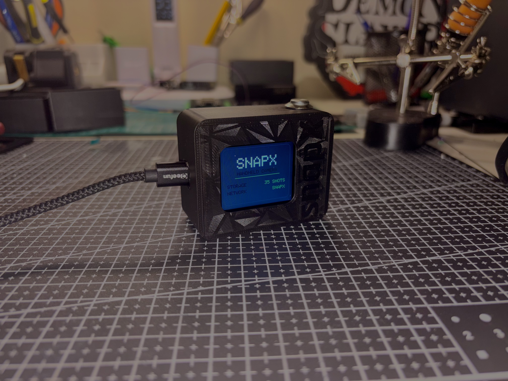

# SNAPX

A handheld camera built on an ESP32-CAM. Live preview on a 1.8 inch TFT, a real metal shutter button, and a WiFi gallery hosted by the camera itself so you can pull photos off it from your phone or laptop without a cable or an SD card reader.

## What it does

- Live camera preview on a 1.8 inch ST7735 panel
- Physical shutter button, one press takes the shot
- Onboard white LED fires as a flash on capture
- Screen flashes white, freezes on the photo you just took, then shows a save confirmation
- Photos save to the ESP32's internal flash as JPEGs
- The camera runs its own WiFi access point with a web gallery for viewing, downloading and deleting photos

## Parts

| Part | Notes |
|---|---|
| AI-Thinker ESP32-CAM | Classic board, OV2640 sensor |
| ESP32-CAM-MB programmer | Type-C, handles flashing so the camera module stays seated |
| 1.8" ST7735S SPI TFT | 128x160, 4-wire SPI. The module's own SD slot is unused |
| 12mm momentary push button | Metal, prewired, 1NO |
| 18650 cell + power bank enclosure | Type-C in, 5V USB out into the board's micro USB |

## Wiring

Screen to board:

| Screen | ESP32-CAM |
|---|---|
| VCC | 3.3V |
| GND | GND |
| CS | GPIO13 |
| DC (A0) | GPIO12 |
| MOSI (SDA) | GPIO15 |
| SCK | GPIO14 |
| LED | 3.3V |
| RESET | Not wired to a GPIO, `TFT_RST` is set to -1 in firmware |

Everything else:

| Component | Pin |
|---|---|
| Shutter button | GPIO3 to one leg, GND to the other, internal pullup |
| Flash LED | GPIO4, onboard, PWM channel |

The camera sensor uses the standard AI-Thinker pin map, which eats most of the board's usable GPIO. GPIO3 is also the serial RX line the programmer uses, so the button shares it.

## Flashing

Board settings in Arduino IDE:

- Board: **AI Thinker ESP32-CAM**
- Partition Scheme: **Huge APP (3MB No OTA / 1MB SPIFFS)**

PSRAM has no separate toggle for this board - it's built into the board definition and is always on, nothing to enable.

Libraries:

- Adafruit GFX Library
- Adafruit ST7735 and ST7789 Library

`esp_camera`, `LittleFS`, `WiFi` and `WebServer` all ship with the ESP32 Arduino core, nothing extra to install.

The classic ESP32-CAM has no auto reset circuit. If you are flashing without the ESP32-CAM-MB programmer, GPIO0 has to be tied to GND before the chip resets, then disconnected afterwards so it boots normally.

## Using it

1. Power it up. You get a splash screen, then a boot report for storage, network and sensor.
2. Point it, press the button. Flash fires, screen freezes on the shot, and it saves.
3. To get photos off it, connect to the WiFi network `SNAPX` (password `1523`) and open `http://192.168.4.1/` in a browser.

The gallery gives you a grid of every photo on the device. Click one for a full size view with arrow key navigation and a download button, or delete straight from the grid.

## How it works

The preview loop does not touch JPEG at all. The camera is configured for `PIXFORMAT_RGB565` at QVGA, which is already the pixel format the ST7735 wants, so frames go straight from the camera buffer to the display with no decode step. Rotation and scaling run off lookup tables built once on the first frame instead of being recalculated per pixel.

JPEG encoding only happens on capture, via `frame2jpg` at quality 95, and the result is written to LittleFS under `/photos` as `img_00001.jpg` and up. The index is recovered on boot by scanning the directory, so numbering survives power cycles.

Photos live on internal flash rather than an SD card. The pins that would be needed for SD chip select and MISO are the same ones the USB programmer uses for serial, which would have meant unplugging the SD wiring on every flash. The WiFi gallery exists to solve the resulting problem of getting files off the device.

## Known issues

- Saved photos come out rotated 90 degrees relative to what you see in the preview. The preview is rotated in software, the encoder gets the raw buffer.
- Preview frame rate is limited by SPI throughput to the panel. It is fine for framing a shot, it is not smooth video.
- The brownout detector is disabled at boot. Powering this off anything that sags under load will cause problems that look like display bugs.

## Roadmap

- Fix the saved photo orientation
- Long press to browse the gallery on the device screen
- Proper enclosure

## License

MIT, see [LICENSE](LICENSE).
