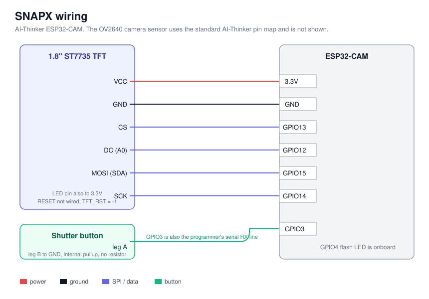
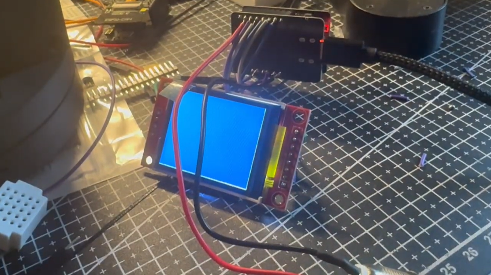

# SNAPX

SNAPX is a small handheld camera I built on an ESP32-CAM. It has a live preview on
a 1.8 inch screen, a real metal shutter button on the side, and a 3D printed case I
designed in Onshape. When you press the button it takes a photo and saves it to the
ESP32's own flash memory. There is no SD card. To get the photos off it, the camera
makes its own WiFi network and hosts a small web gallery, so you connect your phone
to it, open a page in the browser, and you can view, download or delete every photo
on the device.

I made it because I wanted to build a camera from the sensor up instead of buying
one, and the ESP32-CAM is cheap and already has most of what you need on it.
Getting a live preview that was actually fast enough to use, and working around the
fact that there were no pins left for an SD card, were the two hard parts. Both are
written up further down.

The full writeup, more photos and the demo videos are on my site:
https://ebensiyabalapitiya.site/projects/snapx

## The build


## What is in this repo

There is no custom PCB. SNAPX is off-the-shelf modules wired together by hand,
so the wiring diagram below is the whole electrical side of it.

| Folder | What is in it |
|---|---|
| `Firmware/` | The firmware. One Arduino sketch at `Firmware/SnapX/SnapX.ino` |
| `CAD/` | STL files for printing, and STEP files for editing the design |
| `docs/` | The build photo and the wiring diagram |
| `BOM.csv` | Every part you need |

## Parts

The full list with notes is in [BOM.csv](BOM.csv). The short version:

| Part | Notes |
|---|---|
| AI-Thinker ESP32-CAM | Classic board with the OV2640 sensor |
| ESP32-CAM-MB programmer board | Plugs onto the ESP32-CAM, makes flashing easy |
| 1.8 inch ST7735S SPI TFT | 128x160. The SD slot on it is not used |
| 12mm metal push button | Momentary, prewired |
| 18650 power bank enclosure and one 18650 cell | 5V USB out, sits outside the case |
| Onboard white LED on GPIO4 | Already on the board, used as the flash |
| Jumper wire and solder | For the screen and the button |

## Wiring



Screen to board:

| Screen pin | ESP32-CAM |
|---|---|
| VCC | 3.3V |
| GND | GND |
| CS | GPIO13 |
| DC (A0) | GPIO12 |
| MOSI (SDA) | GPIO15 |
| SCK | GPIO14 |
| LED | 3.3V |
| RESET | Not wired. `TFT_RST` is set to -1 in the firmware |

Button:

| Button | Goes to |
|---|---|
| One leg | GPIO3 |
| Other leg | GND |

No resistor needed. The firmware uses the internal pull-up and debounces the
button in software.

The flash is the white LED already on the board, on GPIO4.

The camera sensor uses the standard AI-Thinker pin map. The firmware handles it,
but it is the reason almost every pin is taken:

```
PWDN 32  RESET -1  XCLK 0  SIOD 26  SIOC 27
Y9 35  Y8 34  Y7 39  Y6 36  Y5 21  Y4 19  Y3 18  Y2 5
VSYNC 25  HREF 23  PCLK 22
```

This is what it looks like wired up on the bench, before any of it goes in the
case. Screen running off the board, jumpers to the ESP32-CAM-MB, power in over
USB.



## Flashing

Open `Firmware/SnapX/SnapX.ino` in the Arduino IDE.

Board settings:

| Setting | Value |
|---|---|
| Board | AI Thinker ESP32-CAM |
| PSRAM | Enabled |
| Partition Scheme | Huge APP (3MB No OTA / 1MB SPIFFS) |

Install these two libraries from the Library Manager:

- Adafruit GFX Library
- Adafruit ST7735 and ST7789 Library

`esp_camera`, `LittleFS`, `WiFi` and `WebServer` already come with the ESP32 board
package, so there is nothing else to add.

The WiFi name and password are at the top of the sketch in a block marked
`USER CONFIG`. Change them if you want:

```c
#define AP_SSID     "SNAPX"
#define AP_PASSWORD "snapx1523"
```

The password has to be 8 to 63 characters or WPA2 will not take it. Set it to `""`
for an open network.

Two things that got me while building this:

1. The classic ESP32-CAM has no USB port and no auto reset. The ESP32-CAM-MB board
   handles that for you. If you flash without it, you have to connect GPIO0 to GND
   before you reset the board, start the upload, then take GPIO0 off GND so it
   boots your code instead of the bootloader.
2. Pick "AI Thinker ESP32-CAM" as the board, not "ESP32 Dev Module". The generic
   profile leaves PSRAM turned off, and then the camera will not start. It fails
   with a frame buffer malloc error. The camera needs PSRAM for its buffers.

## Using it

1. Plug in the power bank. You get a splash screen and then a short readout saying
   storage, network and sensor are up.
2. Point it and press the button. The LED fires, the screen goes white for a
   moment and freezes on the shot, then it saves.
3. To get the photos, connect your phone or laptop to the WiFi network `SNAPX`
   with the password `snapx1523`, then open `http://192.168.4.1/` in a browser.

The gallery shows every photo in a grid. Click one to see it full size with next
and previous and a download button. There is a small delete button on each photo.

## How it works

The preview never touches JPEG. The camera is set to RGB565 at QVGA, which is
already the format the screen wants, so each frame goes straight from the camera to
the display with no decoding step in between. The rotate and resize from the
320x240 camera frame down to the 160x128 screen is done with lookup tables that get
built once on the first frame, instead of being worked out for every pixel every
time. Before I did that the preview ran at about 0.1 fps. After it, it is actually
usable.

JPEG only happens when you press the shutter. The frame gets encoded with
`frame2jpg` at quality 95 and written to LittleFS under `/photos` as `img_00001.jpg`,
`img_00002.jpg` and so on. On startup the firmware reads that folder to find the
highest number, so the count keeps going after you unplug it.

The OV2640 has white balance, gain, exposure and lens correction switched off by
default. Turning them on made a big difference to how the photos look. Lens
correction is the one that fixes the dark corners.

## Why there is no SD card

This is the part that confuses people, so it is worth explaining. The camera sensor
uses almost every usable pin on the ESP32-CAM. The few that are left are the serial
lines the USB programmer needs, and one of those is where the shutter button is.
There were no pins left for SD card chip select and MISO. So photos go to the
internal flash instead, and the WiFi gallery is there to solve the problem that
created, which is getting the files back off the camera without pulling a card out.

## Case

The files are in [CAD/](CAD/), with a README in that folder that covers print
settings. Print `Case.stl` and `Cover.stl` once each, PLA or PETG, 0.2 mm layers,
3 walls, 15 to 20 percent infill, no supports. `SNAPX-enclosure.step` is the full
assembly if you want to change the design in another CAD program, and there are
per part STEP files next to it. The battery is a USB power bank that stays
outside, so the case only has to hold the board, the screen and the button.

## Known issues

- Saved photos come out rotated 90 degrees from what you saw in the preview. The
  preview is rotated in software and the encoder is handed the raw frame, so the
  two do not match. This is on my list to fix.
- The preview is only as fast as the screen can be written over SPI. It is fine for
  lining up a shot. It is not smooth video.
- The brownout detector is turned off at startup. If you power the camera from
  something that dips under load, you get glitches that look like screen bugs but
  are really the power dropping.
- The gallery only lists the first 200 photos. Anything past that is still saved
  and still downloads if you type the URL, it just does not show in the grid.
- The gallery has no password of its own. Anyone on the `SNAPX` WiFi can view and
  delete the photos. The WiFi password is the only thing in the way.
- You cannot look back at photos on the camera screen yet, only in the web gallery.

## License

MIT, see [LICENSE](LICENSE). Copyright Eben Siyabalapitiya.
